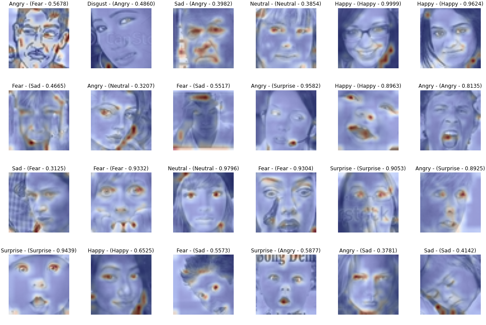
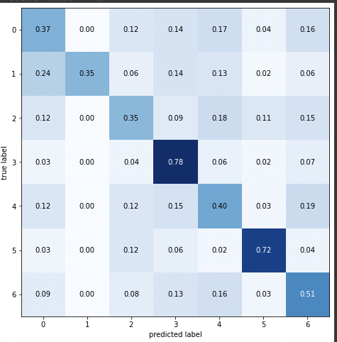
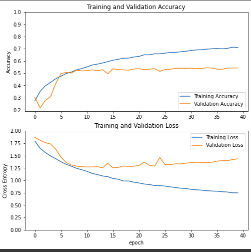

# Face Emotions Recognition 
  *INSERT HERE DESCRIPTION OF THE PROJECT*
  
  
  
## Info
This project uses react-native and expo. For info:
- https://reactnative.dev/
- https://expo.dev/

## SETUP
```
    npm install
    npm run start
```

## MODEL EXPORT
On google colab or every notebook you prefer
```
!pip install tensorflowjs
import tensorflowjs as tfjs

## This will save model and weights on the folder called /models
tfjs.converters.save_keras_model(model, 'models')
```

## RUN ON IOS 
Download the *Expo GO* application and then start the progect with the command below. Once the project is started you can open the camera of your phone and point to the QR Code.